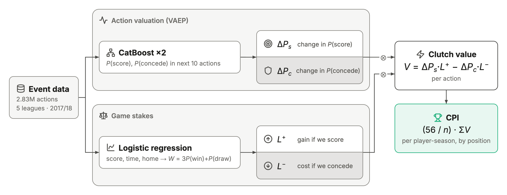

# Measuring Clutch Performance in Soccer When the Result Is on the Line

Code, data and results for our MIT Sloan Sports Analytics Conference 2027 research-paper submission
(abstract: [`abstract/clutch_abstract.pdf`](abstract/clutch_abstract.pdf)).

**Authors:** Kazi Shahid Ahmed Galib, Shihab Shahriar, Tarvir Anjum Aditto

A **clutch** action is one that adds value when the result is on the line: it makes a goal more likely when
scoring would change the result, or a goal against less likely when conceding would. The
**Clutch Performance Index (CPI)** turns this into a player rating. Every on-ball action is credited with how
much it changed its team's chances of scoring and conceding, each weighted by what the next goal would be worth
in league points, and the credit is averaged over the season.



## Method in one paragraph

**Action values (top branch).** Two gradient-boosted classifiers (CatBoost), trained leave-one-league-out,
estimate for every game state the probability that the acting team scores, `P_s`, and concedes, `P_c`,
within the next ten actions. An action's effect is `ΔP_s` and `ΔP_c`, the changes it causes.
**Game stakes (bottom branch).** A logistic regression on goal difference, time left and home advantage
(team strength left out on purpose) gives win and draw probabilities and expected league points
`W = 3·P(win) + P(draw)`. The stakes are `L+ = W(g+1) − W(g)`, the gain if the team scores next, and
`L− = W(g) − W(g−1)`, the cost if it concedes next.
**Clutch value.** `V = ΔP_s·L+ − ΔP_c·L−` for each action; a player's `CPI = (56 / n)·ΣV` over the season
(56 = median actions per appearance; players with 700+ actions are ranked, within position).

## Key results (2017/18, five top European leagues, 1,826 matches, 2.83M actions)

| Result | Value | Where |
|---|---|---|
| Action-value models, out-of-league ROC-AUC (scoring / conceding) | 0.776 / 0.805 | `stage3_vaep/evaluation_metrics.csv` |
| Real final results, leading by one after 80': cost of conceding vs gain from scoring | 1.59 vs 0.20 points; difference 1.40 [95% CI 1.30, 1.48] | `stage7_validation/t1_real_outcome_stakes.csv` |
| Tracking the real cost of conceding across 44 minute-by-score states (Spearman) | L−: 0.98 [0.97, 0.99]; scoring-only pressure: 0.39 [0.35, 0.40] | `stage7_validation/t2_validity.csv` |
| Goal-prevention credit while ahead, two-sided / scoring-only weighting | GK 2.57, DEF 2.74, MID 3.01 (all CIs above 2.5) | `stage7_validation/t3_credit_ratios.csv` |
| Season CPI split-half reliability (Spearman–Brown) | 0.51 (unweighted VAEP 0.56) | `stage6_cpi/split_half_stability.csv` |

Top three per position (95% intervals from 1,000 match resamples; goalkeepers ranked on goal prevention):

| Position | Players (CPI, share of resamples in position top 10) |
|---|---|
| Forwards | Icardi 0.62 (83%), Cavani 0.50 (75%), Immobile 0.43 (53%) |
| Midfielders | Bernardeschi 0.32 (52%), Kwon Chang-Hoon 0.31 (56%), Rony Lopes 0.30 (47%) |
| Defenders | Laguardia 0.30 (74%), Debuchy 0.25 (68%), Ramis 0.22 (50%) |
| Goalkeepers | Oblak 0.28 (97%), Oier 0.24 (62%), Guaita 0.24 (66%) |

Full tables: `stage6_cpi/leaderboards/`.

## Repository layout

```
WyScout/              raw Wyscout data (CC BY 4.0), fetched by get_data.py
feature-engineering/  stage 1-2 notebooks: SPADL actions, features, Elo, merge
pipeline-stages/      stage 3-7 notebooks: action values, stakes, clutch values, CPI, tests
data/                 derived per-action data used by stages 5-7
stage3_vaep/ ... stage7_validation/   results (CSV) and plots written by each stage
abstract/             submitted abstract (PDF, LaTeX) and pipeline figure
```

| Notebook | Does | Writes |
|---|---|---|
| `feature-engineering/stage1_spadl_and_features.ipynb` | Wyscout events → SPADL actions + features | `intermediate/`* |
| `feature-engineering/stage2_elo_and_merge.ipynb` | pre-match Elo, merge into one table | `data/stage1_stage2_features.csv`*, `data/stage2_elo_matches.csv` |
| `pipeline-stages/stage3_vaep_lolo.ipynb` | CatBoost action-value models, leave-one-league-out | `stage3_vaep/evaluation_metrics.csv`; models, predictions and `vaep_all_leagues.parquet`* |
| `pipeline-stages/stage4_win_prob_leverage.ipynb` | outcome model, `W`, `L+`, `L−` | `data/leverage_index.parquet`, `stage4_winprob/` |
| `pipeline-stages/stage5_clutch_action_valuation.ipynb` | clutch value `V` per action | `data/clutch_values_signed.parquet`, `stage5_clutch/` |
| `pipeline-stages/stage6_cpi_aggregation.ipynb` | CPI, rankings, split-half stability | `data/cpi_signed_full.parquet`, `stage6_cpi/` |
| `pipeline-stages/stage6b_cpi_leaderboards.ipynb` | per-position leaderboards, match bootstrap | `stage6_cpi/leaderboards/` |
| `pipeline-stages/stage7_validation_tests.ipynb` | real-result checks and statistical tests | `stage7_validation/` |

\* Not stored because of size (the 1.4 GB features table, Stage 1 intermediates, Stage 3 models and predictions); the notebooks regenerate them.
`data/clutch_values_signed.parquet` is a folder of two parts (GitHub's 100 MB file limit); `pandas.read_parquet` reads it as one table.

## Reproducing

**Hardware.** All notebooks were run on Google Colab; Stage 3 (CatBoost) used Colab's NVIDIA T4 GPU, about
10 minutes per fold. Stages 6, 6b and 7 also run on a laptop in under a minute.

```bash
git clone <this repository> && cd clutch-cpi-soccer
pip install -r requirements.txt
python get_data.py                  # unpack the raw Wyscout data in WyScout/
```

Open the notebooks from their own folder (`feature-engineering/` or `pipeline-stages/`); each one finds the
repository root and reads and writes relative to it. Random seed: 42.

- **Quick check:** the derived data is included, so stages 6, 6b and 7 run directly. They are stored with their outputs.
- **Full pipeline:** run stages 1 to 7 in order. Stages 1-5 are stored without outputs (they need a GPU and the
  1.4 GB features table); the files they wrote are listed in the table above.

## Data

Raw data: Pappalardo et al., *A public data set of spatio-temporal match events in soccer competitions*,
Scientific Data 6, 236 (2019), https://doi.org/10.1038/s41597-019-0247-7, released under CC BY 4.0.
See [`DATA_LICENSE.md`](DATA_LICENSE.md). Code: MIT licence ([`LICENSE`](LICENSE)).
